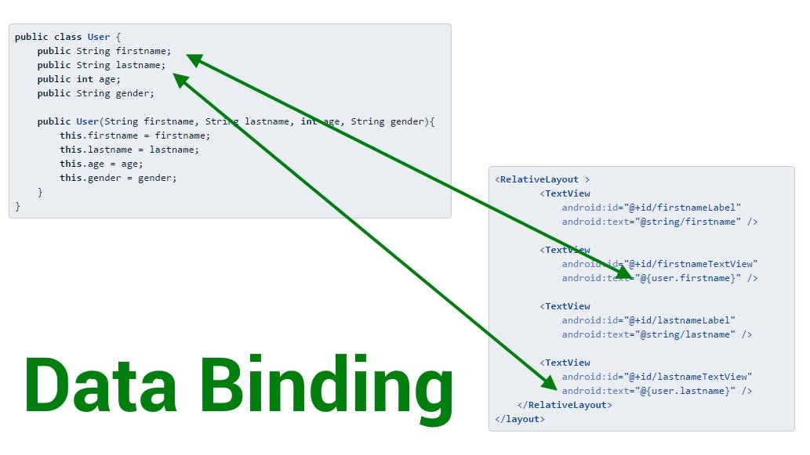

# AngularTwin1Project

This project was generated with [Angular CLI](https://github.com/angular/angular-cli) version 15.2.9.

## Follow these steps for add this project 

1. Download [Node js LTS](https://nodejs.org)
2. Open cmd and add this 2 command `npm -v` , `node -v`
3. Add cli in cmd with this command `npm install -g @angular/cli@15`
4. clone or download project from github and navigate to the project directory using cmd and add `npm install` to install the project's dependencies and Run `ng serve --open` to run the server.

## Here we add all important command angular 

- **RUN `ng v`**: Check the version of Angular.
- **RUN `ng new NameProject`**: Create a new Angular project.
- **RUN `ng generate component NameComponent`**: Add a new component.
- **RUN `ng generate componenet user/components/adddUser --module=user`**: for added to specific module.
- **RUN `ng generate module NameModule`**: Add a new module.
- **RUN `ng generate service NameService`**: Add a new service.
- **RUN `ng serve` or `ng serve --open`**: Start the application.
- **RUN `ng build`**: Build your Angular application.
- **RUN `ng test`**: Run unit tests using Karma.
- **RUN `ng e2e`**: Execute end-to-end tests using Protractor.
- **RUN `ng lint`**: Lint your code for coding standards.
- **RUN `ng update`**: Check and update project dependencies.
- **RUN `ng add <package-name>`**: Add libraries and packages to your project.
- **RUN `ng eject`**: Eject the Angular CLI configuration for advanced control.

## command maybe needed in your project

- **RUN `npm install bootstrap`**: Install Bootstrap for CSS framework.
- **RUN `npm install ngx-bootstrap`**: Install ngx-bootstrap for using Bootstrap components in Angular.
- **RUN `npm install fontawesome --save`**: Install Font Awesome for an icon library.
- **RUN `npm install @fortawesome/fontawesome-free --save`**: Install free icons from Font Awesome.
- **RUN `npm install sweetalert2`**: Install SweetAlert2 for alert message boxes.
- **RUN `npm install axios`**: Install Axios for making HTTP requests.
- **RUN `npm install moment`**: Install Moment.js for date and time formatting.
- **RUN `npm install chart.js`**: Install Chart.js for creating graphical representations.
- **RUN `npm install rxjs-compat --save`**: Install the RxJS compatibility library.
- **RUN `npm install ngx-pagination`**: Install the ngx-pagination library for adding pagination.
- **RUN `npm install ng2-charts`**: Install ng2-charts for integrating Chart.js for charts.
- **RUN `npm install ng-bootstrap`**: Install ng-bootstrap for official Bootstrap components.
- **RUN `npm install ng-select`**: Install ng-select for customizable dropdowns.
- **RUN `npm install ngx-toastr`**: Install ngx-toastr for toast notifications.
- **RUN `npm install ngx-spinner`**: Install ngx-spinner for loading spinners.
- **RUN `npm install ng2-file-upload`**: Install ng2-file-upload for handling file uploads.
- **RUN `npm install ngx-translate/core ngx-translate/http-loader --save`**: Install ngx-translate libraries for internationalization.
- **RUN `npm install ng2-dnd --save`**: Install ng2-dnd for drag-and-drop functionality.
- **RUN `npm install ng-quill`**: Install ng-quill for integrating the Quill rich text editor.

## Further help

To get more help on the Angular CLI use `ng help` or go check out the [Angular CLI Overview and Command Reference](https://angular.io/cli) page.

## DataBinding (Oneway and twoWay)
Data binding is one of the most powerful features of Angular, which allows you to create dynamic applications by connecting HTML elements directly to JavaScript variables.

## Here is a table that summarizes the key differences between template-driven forms and reactive forms:

1. template driven Form : 
=> ngModel/ngForm(FormsModule)
=> validateurs a définir dans l'html (required,minlength...)
=> message d'erreur des HTML 

## controle de saisie
- **cote client :** 
- Validation des entrées par le navigateur avant envoi du formulaire au serveur.
- Affichage d'erreurs directement sur les champs.
- Utilisation de la directive [required] pour valider un champ obligatoire.
- Utilisation de la directive [minLength], [maxLength] ou [pattern] pour définir des conditions de validation plus complexes.
- Utilisation de la directive [minLength], [maxLength] ou [pattern] pour valider une longueur minimale, maximale ou
- Utilisation de la directive [(ngModel)] pour lier une valeur à un champ HTML(surveille l'eat de element html associé et utiliser two way databinding)
=> valid/invalid/errors(Validateurs) , dirty/pristine/touched/intouched(action de l'utilisation)
Exemple :

- **côté serveur :**
- La validation est faite après l’envoi du formulaire, ce qui peut entraîner une perte de temps et une charge supplémentaire.
- Les erreurs sont renvoyées dans le corps de la réponse JSON ou XML.
- Le formatage des dates est effectué côté serveur.
- L’utilisateur ne peut pas modifier les données qu’il n’a pas accès.
- La validation est faite par l’application serveur, qui utilise des bibliothèques tierces telles que Hibernate Validator
- La validation est faite avant l’insertion des données dans la base de données.

